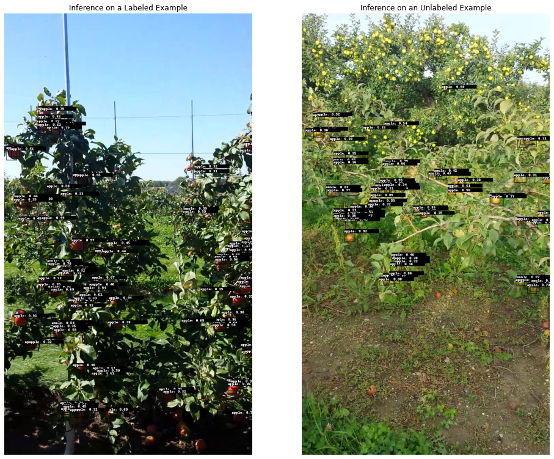

# Active Learning with Nvidia TAO
Tutorial on active learning with Nvidia Train, Adapt, and Optimize (TAO).

**Disclaimer:** In order to run Nvidia TAO, you need to setup Nvidia NGC and TAO. If you don't have this already, we will walk you through it in section [1.2](#tao).

In this tutorial, we will show you how you can do active learning for object detection with [Nvidia TAO](https://developer.nvidia.com/tao-toolkit). The task will be object detection of apples in a plantation setting. Accurately detecting and counting fruits is a critical step towards automating harvesting processes.
Furthermore, fruit counting can be used to project expected yield and hence to detect low yield years early on.

The goal of the tutorial is to train an object detection model to good accuracy with as little labeling as possible. For this, we do active learning 
with the Lightly Worker and use the Nvidia TAO framework as it's optimized for fast transfer learning on small datasets.

The structure of the tutorial is as follows:


1. [Prerequisites](#prerequisites)
    1. [Set up Lightly](#lightly)
    2. [Set up Nvidia TAO](#tao)
    3. [Data](#data)
    4. [Cloud Storage](#cloudstorage)
2. [Active Learning](#al)
    1. [Initial Selection](#selection)
    2. [Training and Inference](#training)
    3. [Active Learning Step](#alstep)
    4. [Re-training](#retraining)


To get started, clone this repository to your machine and change the directory.
```
git clone https://github.com/lightly-ai/NvidiaTAOActiveLearning.git
cd NvidiaTAOActiveLearning
```


## 1 Prerequisites <a name=prerequisites>

For this tutorial, you require `python >= 3.6.9` and `python <= 3.9`.

### 1.1 Set up Lightly <a name=lightly>
To set up `lightly` for active learning, head to the [Lightly Platform](https://app.lightly.ai) and create a free account by logging in. Make sure to get your token by clicking on your e-mail address and selecting "Preferences". You will need the token for the rest of this tutorial so let's store it in an environment variable:
```
export LIGHTLY_TOKEN="YOUR_TOKEN"
```

Then, install the Lightly API Client and pull the latest Lightly Worker Docker image:
```
pip3 install lightly
docker pull lightly/worker:latest
```
For a full set of instructions, check out the [docs](https://docs.lightly.ai/docs/install-lightly). Finally, register the Lightly Worker in the Lightly Platform by running the following script (note that the Lightly token is fetched from the environment variable):
```
python3 register_worker.py
```

Store the worker id from the output in an environment variable:
```
export LIGHTLY_WORKER_ID="YOUR_WORKER_ID"
```


### 1.2 Set up Nvidia TAO <a name=tao>

To install Nvidia TAO, follow [these instructions](https://docs.nvidia.com/tao/tao-toolkit/text/tao_toolkit_quick_start_guide.html#tao-toolkit-package-content). If you want to use custom scripts for training and inference, you can skip this part.


Setting up Nvidia TAO can be done in a few minutes and consists of the following steps:
1. Install [Docker](https://www.docker.com/).
2. Install [Nvidia GPU driver](https://www.nvidia.com/Download/index.aspx?lang=en-us) v455.xx or above.
3. Install [nvidia docker2](https://docs.nvidia.com/datacenter/cloud-native/container-toolkit/install-guide.html).
4. Get an [NGC account and API key](https://ngc.nvidia.com/catalog). The API key can be found in the settings (top right), under "Setup" and ["Generate API Key"](https://ngc.nvidia.com/setup/api-key).
5. Install the `ngc` [command-line tool](https://ngc.nvidia.com/setup/installers/cli)
6. Install the Nvidia [TAO launcher](https://docs.nvidia.com/tao/tao-toolkit/text/tao_toolkit_quick_start_guide.html#installing-tao-launcher)

Check your installation is correct:
```
which ngc
which tao
```

Make sure to keep the Nvidia API key in a safe location as we're going to need it later:
```
export NVIDIA_API_KEY="YOUR_NVIDIA_API_KEY"
```

To make all relevant directories accessible to Nvidia TAO, you need to mount the current working directory and the `yolo_v4/specs` directory to the Nvidia TAO docker. You can do so with the provided `mount.py` script.

```
python3 mount.py
```

Next, you need to specify all training configurations. Nvidia TAO expects all training configurations in a `.txt` file which is stored in the `yolo_v4/specs/` directory. For the purpose of this tutorial **we provide an example in `yolo_v4_minneapple.txt`**. The most important differences to the example script provided by Nvidia are:
- Anchor Shapes: We made the anchor boxes smaller since the largest bounding boxes in our dataset are only approximately 50 pixels wide.
- Augmentation Config: We set the output width and height of the augmentations to 704 and 1280 respectively. This corresponds to the shape of our images.
- Target Class Mapping: For transfer learning, we made a target class mapping from `car` to `apple`. This means that every time the model would now predict a car, it predicts an apple instead.

### 1.3 Data <a name=data>
In this tutorial, we will use the [MinneApple fruit detection dataset](https://conservancy.umn.edu/handle/11299/206575). It consists of 670 training images of apple trees, annotated for detection and segmentation. The dataset contains images of trees with red and green apples.

**Note:** Nvidia TAO expects the data and labels in the [KITTI format](https://github.com/bostondiditeam/kitti/blob/master/resources/devkit_object/readme.txt). This means they expect one folder containing the images and one folder containing the annotations. The name of an image and its corresponding annotation file must be the same apart from the file extension. [You can find the MinneApple dataset converted to this format attached to the first release of this tutorial](https://github.com/lightly-ai/NvidiaTLTActiveLearning/releases/download/v1.0-alpha/minneapple.zip). Alternatively, you can download the files from the official link and convert the labels yourself.

Create a `data/` directory, move the downloaded `minneapple.zip` file there, and unzip it

```
  mkdir data
  cd data
  wget "https://github.com/lightly-ai/NvidiaTLTActiveLearning/releases/download/v1.0-alpha/minneapple.zip"
  unzip minneapple.zip
  rm minneapple.zip
  cd ..
  tree -d data/
```

The output of the `tree` command should be:
```
data/
└── raw
    ├── images
    └── labels
```

Here's an example of how the converted labels look like. Note how we use the label `car` instead of `apple` because of the target class mapping we had defined in section [1.2](#tao).

```
Car 0. 0 0. 1.0 228.0 6.0 241.0 0. 0. 0. 0. 0. 0. 0.
Car 0. 0 0. 5.0 228.0 28.0 249.0 0. 0. 0. 0. 0. 0. 0.
Car 0. 0 0. 30.0 238.0 46.0 256.0 0. 0. 0. 0. 0. 0. 0.
Car 0. 0 0. 37.0 214.0 58.0 234.0 0. 0. 0. 0. 0. 0. 0.
Car 0. 0 0. 82.0 261.0 104.0 281.0 0. 0. 0. 0. 0. 0. 0.
Car 0. 0 0. 65.0 283.0 82.0 301.0 0. 0. 0. 0. 0. 0. 0.
Car 0. 0 0. 82.0 284.0 116.0 317.0 0. 0. 0. 0. 0. 0. 0.
Car 0. 0 0. 111.0 274.0 142.0 306.0 0. 0. 0. 0. 0. 0. 0.
Car 0. 0 0. 113.0 308.0 131.0 331.0 0. 0. 0. 0. 0. 0. 0.
```


### 1.4 Cloud Storage <a name=cloudstorage>

In order for Lightly to be able to access the images, they need to be stored in a cloud storage. For the purposes of this tutorial, we'll use
S3. Create a new S3 bucket with a directory `minneapple`. 

Next, make sure you have the [AWS CLI](https://docs.aws.amazon.com/cli/latest/userguide/getting-started-install.html) tool installed:

```
aws --version
```

Sync the raw data:

```
aws s3 sync data/ s3://YOUR_BUCKET_HERE/minneapple
```


Next, you need to create a place where Lightly can store outputs and read predictions from. Create a new directory called `minneapple_out`
in your S3 bucket. Then, run the following commands

```
mkdir infer_labels
python3 tao_to_lightly.py --input_dir infer_labels
aws s3 sync .lightly/ s3://YOUR_BUCKET_HERE/minneapple_out/.lightly
```

The `tao_to_lightly.py` file performs the followings steps:
- It lists all predictions in the directory `infer_labels` (currently none!).
- If there are predictions, it converts them to the Lightly format and stores them in `.lightly/predictions`.
- It creates the required `tasks.json` and `schema.json` files under `.lightly/predictions` (visit the [Lightly documentation](https://docs.lightly.ai/docs/prediction-format) for more information).

If you want to write your own script, you can take [ours as a reference](tao_to_lightly.py). Note that we will run this exact script again once we have our first set of predictions.

The output directory in your S3 bucket should have the following structure now:
```
minneapple_out/
└── .lightly/
    └── predictions
        ├── minneapple
        │   ├── raw
        │   │   └── images
        │   └── schema.json
        └── tasks.json
```

What you just did is prepare the output directory to be filled with predictions when you start doing active learning.


Now, all that's left is to create credentials such that Lightly can access the data. For S3 buckets, we recommend to use delegated access. Follow the instructions [here](https://docs.lightly.ai/docs/aws-s3#setup-access-policies) to set up `list` and `read` permissions for the input folder and `list`, `read`, `write` and `delete` permissions for the output folder. Store the credentials in environment variables:
```
export S3_REGION="YOUR_S3_REGION"

export S3_INPUT_PATH="s3://YOUR_BUCKET_HERE/minneapple"
export S3_INPUT_ROLE_ARN="YOUR_INPUT_ROLE_ARN"
export S3_INPUT_EXTERNAL_ID="YOUR_INPUT_EXTERNAL_ID"

export S3_LIGHTLY_PATH="s3://YOUR_BUCKET_HERE/minneapple_out"
export S3_LIGHTLY_ROLE_ARN="YOUR_LIGHTLY_ROLE_ARN"
export S3_LIGHTLY_EXTERNAL_ID="YOUR_LIGHTLY_EXTERNAL_ID"
```

Congrats! You're ready to start doing active learning with Lightly and Nvidia TAO.


## 2 Active Learning <a name=al>
Now that the setup is complete, you can start the active learning loop. In general, the active learning loop will consist of the following steps:
1. Initial selection: Get an initial set of images to annotate and train on.
2. Training and inference: Train on the labeled data and make predictions on all data.
3. Active learning query: Use the predictions to get the next set of images to annotate, go to 2.

We will walk you through all three steps in this tutorial.


### 2.1 Initial Selection <a name=selection>

To do the initial selection, you first need to [start up the Lightly Worker](https://lightly-docs.readme.io/docs/install-lightly#register-the-lightly-worker). Open up a new terminal, and run the following commands:

```
export LIGHTLY_TOKEN="YOUR_TOKEN"
export LIGHTLY_WORKER_ID="YOUR_WORKER_ID"
```
```
docker run --shm-size="1024m" --gpus all --rm -it \
    -e LIGHTLY_TOKEN=$LIGHTLY_TOKEN \
    lightly/worker:latest \
    worker.worker_id=$LIGHTLY_WORKER_ID
```


To schedule a selection job, switch to your first terminal and run
```
python3 schedule.py \
    --dataset-name minneapple \
    --s3-region $S3_REGION \
    --s3-input-path $S3_INPUT_PATH \
    --s3-input-role-arn $S3_INPUT_ROLE_ARN \
    --s3-input-external-id $S3_INPUT_EXTERNAL_ID \
    --s3-lightly-path $S3_LIGHTLY_PATH \
    --s3-lightly-role-arn $S3_LIGHTLY_ROLE_ARN \
    --s3-lightly-external-id $S3_LIGHTLY_EXTERNAL_ID
```

The above script roughly performs the following steps:

- It creates a new dataset in the [Lightly Platform](https://app.lightly.ai) named after the `--dataset-name`.
- If a dataset with the same name already exists, it chooses that one.
- It schedules a job to select images based on diversity and prediction uncertainty _if predictions exist_.

You can use it as a [reference](schedule.py) to write your own script for scheduling jobs.

The job should be picked up and processed by the Lightly Worker after a few seconds. Once the upload has finished, you can visually explore your dataset in the [Lightly Platform](https://app.lightly.ai/).


Before training your machine learning model you first need to annotate the selected images. In the real world, you can use one of [Lightly's 
export features](https://lightly-docs.readme.io/docs/export) to label the images. Here, you can simply simulate this by running
```
python3 annotate.py \
    --dataset-name minneapple \
    --input-dir data/
```

The above script copies images and labels from `data/raw` to `data/train`.

You can verify that the number of annotated images is correct like this:
```
ls data/train/images | wc -l
ls data/train/labels | wc -l
```
The expected output is:
```
100
100
```

### 2.2 Training and Inference <a name=training>
Now that you have your annotated training data, let's train an object detection model on it and see how well it works! Use Nvidia TAO to train a YOLOv4 object detector from the command line. The cool thing about transfer learning is that you don't have to train a model from scratch and therefore require fewer annotated images to get good results.

Start by downloading a pre-trained object detection model from the Nvidia registry.

```
mkdir -p ./yolo_v4/pretrained_resnet18
ngc registry model download-version nvidia/tao/pretrained_object_detection:resnet18 \
    --dest yolo_v4/pretrained_resnet18/
```

Finetuning the object detector on the sampled training data is as simple as the following command.

> If you get an out-of-memory-error you can change the size of the input images and the batch size in the `yolo_v4/specs/yolo_v4_minneapple.txt` file. Change `output_width`/`output_height` or `batch_size_per_gpu` respectively.

```
mkdir -p $PWD/yolo_v4/experiment_dir_unpruned
tao yolo_v4 train \
    -e /workspace/tao-experiments/yolo_v4/specs/yolo_v4_minneapple.txt \
    -r /workspace/tao-experiments/yolo_v4/experiment_dir_unpruned \
    --gpus 1 \
    -k $NVIDIA_API_KEY
```
After 50 epochs, the mAP should be around `0.4`:
```
Epoch 50/50
24/24 [==============================] - 18s 755ms/step - loss: 3724.1823
Producing predictions: 100%|██████████████████████████████████████████████████████████| 12/12 [00:13<00:00,  1.09s/it]
*******************************
apple         AP    0.38859
              mAP   0.38859
*******************************
Validation loss: 3161.037371504934
```

Now that you have finetuned the object detector on your dataset, you can do inference to see how well it works.

Doing inference on the whole dataset has the advantage that you can easily figure out for which images the model performs poorly or has a lot of uncertainties.

```
tao yolo_v4 inference \
    -i /workspace/tao-experiments/data/train/images \
    -e /workspace/tao-experiments/yolo_v4/specs/yolo_v4_minneapple.txt \
    -o /workspace/tao-experiments/infer_images \
    -l /workspace/tao-experiments/infer_labels \
    -m /workspace/tao-experiments/yolo_v4/experiment_dir_unpruned/weights/yolov4_resnet18_epoch_050.tlt \
    --gpus 1 \
    -k $NVIDIA_API_KEY
```

Below you can see two example images after training. It's evident that the model does not perform well on the unlabeled image. Therefore, it makes sense to add more samples to the training dataset.




### 2.3 Active Learning Step <a name=alstep>
You can use the inferences from the previous step to determine which images cause the model problems. With Lightly, you can easily select these images while at the same time making sure that your training dataset is not flooded with duplicates.

First, convert the predictions from the Kitti format to the [Lightly prediction format](https://lightly-docs.readme.io/docs/prediction-format). You can use the following script for this:
```
python3 tao_to_lightly.py --input_dir infer_labels
```

Then, the predictions need to be synced to the S3 bucket such that the Lightly Worker can access them:
```
aws sync .lightly/ $S3_LIGHTLY_PATH/.lightly/
```

Now, you can simply run the same `schedule.py` and `annotate.py` commands as above again to add more images to the dataset:

```
python3 schedule.py \
    --dataset-name minneapple \
    --s3-region $S3_REGION \
    --s3-input-path $S3_INPUT_PATH \
    --s3-input-role-arn $S3_INPUT_ROLE_ARN \
    --s3-input-external-id $S3_INPUT_EXTERNAL_ID \
    --s3-lightly-path $S3_LIGHTLY_PATH \
    --s3-lightly-role-arn $S3_LIGHTLY_ROLE_ARN \
    --s3-lightly-external-id $S3_LIGHTLY_EXTERNAL_ID
```

```
python3 annotate.py \
    --dataset-name minneapple \
    --input-dir data/
```


As before, we can check the number of images in the training set:
```
ls data/train/images | wc -l
ls data/train/labels | wc -l
```
The expected output is:
```
200
200
```

### 2.4 Re-training <a name=retraining>

You can re-train our object detector on the new dataset to get an even better model. For this, you can use the same command as before. If you want to continue training from the last checkpoint, make sure to replace the `pretrain_model_path` in the [specs file](yolo_v4/specs/yolo_v4_minneapple.txt) by a `resume_model_path`.

```
tao yolo_v4 train \
    -e /workspace/tao-experiments/yolo_v4/specs/yolo_v4_minneapple.txt \
    -r /workspace/tao-experiments/yolo_v4/experiment_dir_unpruned \
    --gpus 1 \
    -k $NVIDIA_API_KEY
```

If you're still unhappy with the performance after re-training the model, you can repeat steps [2.2](#training) and [2.3](#alstep) and then re-train the model again.
